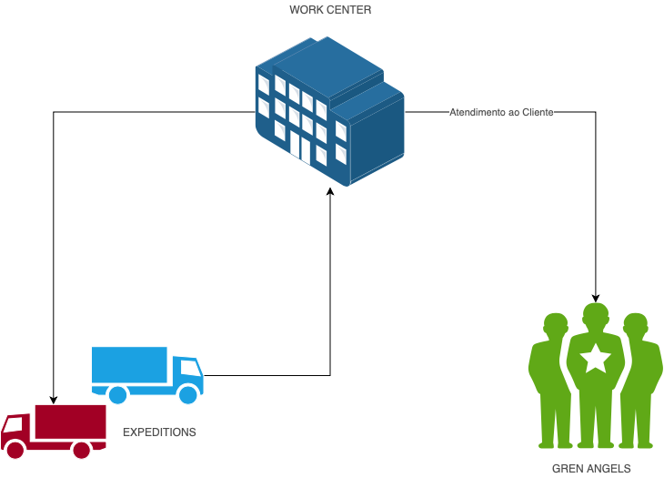
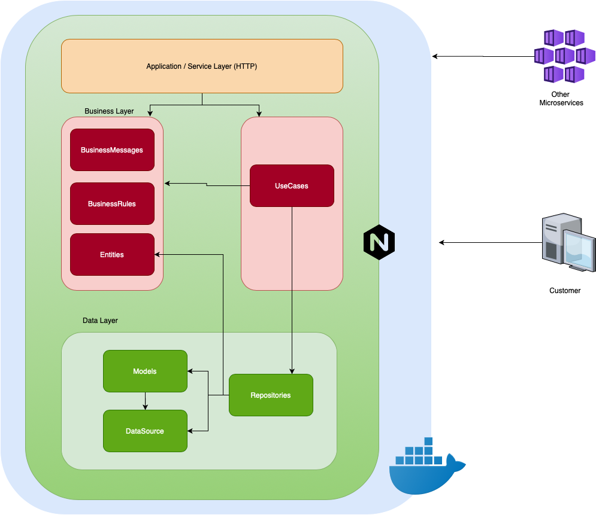

# Stone Challenge

> **Solução Desenvolvida<br>**
> Um melhor monitoramento de estoque de terminais de pagamento para os nossos Green Angels!

<!-- <p align="center">
  
</p> -->

### Sobre o Negócio:

#### - Modelagem:
  

#### - Conceitos:
<ul>
  <li>
    <b>Polos</b> - <i> <small> WorkCenterEntity( ) </small> </i> : <br>
    <p>
      São os centros de suporte aos Green Angels presentes nas regiões onde estamos presentes.
      <br>
    </p>
  </li>
  <li>
    <b>Terminais</b> - <i> <small> TerminaiEntity( ) </small> </i> : <br>
    <p>
      São as nossas Máquinas de pagementos que nossos clientes usam e que nossos Green Angels vendem e entregam para os nossos clientes.
      <br>
    </p>
  </li>
  <li>
    <b>Expedições</b> - <i> <small> ExpeditionEntity( ) </small> </i> : <br>
    <p>
      São os recarregamentos (ou retiradas) de terminais aos Polos, para serem usados por nossos Green Angels
      <br>
    </p>
  </li>
  <li>
    <b>Cobertura</b> - <i> <small> Coverage </small> </i> : <br>
    <p>
      É a quantidade de dias que o estoque de terminais de um polo que o mesmo consegue atender e está é calculada com base na média de consumo de 14 dias
      <br>
    </p>
  </li>
</ul>
<br>
<p>
  O obejetivo do sistema é ajudar a gerenciar as espedições e capacidade de cobertura o mais eficiente o possível, de forma que gere o mínimo de custo o possível a nossa empresa. <br><br>
  Dado que um Green Angel faz um atendimento e a cada atendimento se consome uma quantidade x de terminais dos polos (Por padrão a quantidade consumida é 1), os mesmos precisam ser repostos (Via Expedição) a espedição deve acontecer baseado em um nível de cobertura précalculado pelo sistema ou imposto pelo usuário.
  <br><br>
  Os níveis de cobertura são os seguintes:
  <ul>
    <li>
      <small>
        <i>
        Cobertura de criticidade VERMELHA (PERIGO): abaixo de 10 dias
        </i>
      </small>
    </li>
    <li>
      <small>
        <i>
        Cobertura de criticidade  AMARELA (ATENÇÃO): de 10 a 13 dias
        </i>
      </small>
    </li>
    <li>
      <small>
        <i>
        Cobertura de criticidade  VERDE (COBERTURA IDEAL): de 14 a 18 dias
        </i>
      </small>
    </li>
    <li>
      <small>
        <i>
        Cobertura de criticidade AMARELA (ATENÇÃO):de 19 a 23 dias
        </i>
      </small>
    </li>
    <li>
      <small>
        <i>
        Cobertura de criticidade VERMELHA (PERIGO): acima de 23
        </i>
      </small>
    </li>
  </uL>
  <br>
<p>

#### - Regras de negócio:
<ul>
    <li>
        <b>(BR01)</b> - <i>Um Polo sempre deve ter uma região</i><br>
        <p>Pois nela que os atendimentos são realizados e a região serve de identificação</p>
        <br>
    </li>
    <li>
        <b>(BR02)</b><i> - A cobertura do Polo é formada pela média diária de consumo dos últimos 14 dias vezes a quantitadade disponível em estoque</i><br><br>
    </li>
    <li>
        <b>(BR03)</b><i> - A quantidade disponível em estoque é o resultado entre a subtração da quantidade disponível em estoque vinda das Expedições menos a quantidade de atendimentos do polo</i><br><br>
    </li>
    <li>
        <b>(BR04)</b><i> - O nível de cobertura é determinado pela seguinte regra e classifições</i>
        <ul>
            <li>
              <small>
                <i>
                VERMELHA (PERIGO): abaixo de 10 dias de cobertura
                </i>
              </small>
            </li>
            <li>
              <small>
                <i>
                AMARELA (ATENÇÃO): de 10 a 13 dias de cobertura
                </i>
              </small>
            </li>
            <li>
              <small>
                <i>
                VERDE (COBERTURA IDEAL): de 14 a 18 dias de cobertura
                </i>
              </small>
            </li>
            <li>
              <small>
                <i>
                AMARELA (ATENÇÃO):de 19 a 23 dias de cobertura
                </i>
              </small>
            </li>
            <li>
              <small>
                <i>
                VERMELHA (PERIGO): acima de 23 de cobertura
                </i>
              </small>
            </li>
            <br><br>
          </uL>
    </li>
    <li>
        <b>(BR05)</b><i> - A Predição de demanda necessária é formada pela seguinte é equação: </i>
        <br> <br>
        P = (MD * D) - QuantityOfTerminalsAvailable
        <br><br>
        Onde:<br>
        <ul>
            <li>
                <small>MD => Média diária de consumo</small>
            </li>
            <li>
                <small>D => Dias usados para calcular a média diara de consumo</small>
            </li>
            <li>
                <small>QuantityOfTerminalsAvailable => Quantidade de terminais disponíveis no momento</small>
            </li>
        </ul>
        <br><br>
    </li>
</ul>

#### - Features:
<ul>
    <li>
        <b>Cadastro de Polos</b> <i>- WorkCentersUseCase() </i> <br>
        <p>
        Gerencimento dos registros dos polos. Com o cadastro, atualizacão e remoção, pode ser acessado pela rota: <i>/work-centers</i>
        </p>
        <br>
    </li>
    <li>
        <b>Envio de expedição</b> <i>- ExpeditionsUseCase().create() </i> <br>
        <p>
        Pode se enviar uma expedição a um terminal para o mesmo ter estoque. E está pode preencher o estoque baseado em uma predição ou pela a quantidade que o usuário quiser.
        </p>
        <br>
    </li>
    <li>
        <b>Cancelamento de expedição</b> <i>- ExpeditionsUseCase().cancel() </i> <br>
        <p>
        Pode se cancelar uma expedição enviada ao polo
        </p>
        <br>
    </li>
    <li>
        <b>Pedido de atendimento</b> <i>- AttendenceUseCase().create() </i> <br>
        <p>
        Pode se pedir um terminal via api para que o Green Angel possa atender o cliente.
        </p>
        <br>
    </li>
</ul>

## Tecnologia:
##### Pacotes / Tecnologias utilizados na construção do projeto:

<ul>
    <li><a href="">Falcon API</a></li>
    <li><a href="">SQLAlchemy</a></li>
    <li><a href="">Docker</a></li>
    <li><a href="">Docker Compose</a></li>
    <li><a href="">Loguru</a></li>
    <li><a href="">Gunicorn</a></li>
    <li><a href="">Nginx</a></li>
    <li><a href="">Mysql</a></li>
    <li><a href="">Sphinx</a></li>
    <li><a href="">Python Default UnittTest Lib</a></li>
    <li><a href="">SQLite</a></li>
    <li><a href="">Virtual Env</a></li>
    <li><a href="">Shell</a></li>
    <li><a href="">Amazon CDK</a></li>
</ul>

##### Pré requisitos para rodar o Projeto:

<ul>
    <li>
      <a href="">Instalação do Docker</a>
    </li>
    <li>
      <a href="">Instalação do Docker Compose</a>
    </li>
</ul>

#### Conceitos do Back End:

###### Organização do projeto:
Baseada na clean architecture: <br>


<ul>
    <li>
        <b>Application Layer (HTTP) (ou Service Layer)</b><br>
        <p>Feita com Falcon para fornecer o cliente uma camada de comunicação com o negócio.</p> <br>
    </li>
    <li>
        <b>Use Cases</b><br>
        <p>Utilizado pela application layer para fornecer a funcionalidades da API</p> <br>
    </li>
    <li>
        <b>Bussiness Layer</b><br>
        <p>
          Contém:  <br>
           - As Entidades (WorkCentersEntity, ExpeditionsEntity, AttendenceEntity).<br><br>
           - As regras de negócio (BusinessRules).
          <br><br>
          - E as mensagens entregues ao usuário (BusinessMessages).
          <br><br>
        </p>
    </li>
</ul>

### Conceitos Técnicos utilizados:

<ul>
    <li><a href="">Clean Architecture</a></li>
    <li><a href="">Test Driven Development</a></li>
    <li><a href="">S.O.L.I.D. Concepts</a></li>
    <li><a href="">Unit of Work Pattern</a></li>
    <li><a href="">Singleton Pattern</a></li>
    <li><a href="">Singleton Multi Thread Pattern</a></li>
    <li><a href="">Repository Pattern</a></li>
    <li><a href="">Containização com Docker</a></li>
    <li><a href="">Amazon Elastic Beanstalk</a></li>
    <li><a href="">Amazon R.D.S</a></li>
    <li><a href="">Amazon EC2</a></li>
    <li><a href="">Infra as Code (Em parte do projeto)</a></li>
</ul>

## Como rodar?

🐳 Usando Docker

```
> docker-compose up --build -d
```

## Como rodar os testes unitários?

```
> sh run_tests.sh
```

O back end vai estar disponível em no endereço: http://localhost

## Rotas Backend:


#### Funções

* [Ungrouped](#ungrouped)

  * [Adicionando um Atendimento](#1-add-attendence)
  * [Enviando Uma Expedição](#2-add-expedition)
  * [Enviando Uma Expedição com a predição de terminais necessários](#3-add-expedition-auto-predict-terminals)
  * [Enviando Uma Expedição que retira terminais](#4-add-expedition-negative)
  * [Cancelando um atendimento](#5-cancel-a-attendence)
  * [Cancelando uma Expedição](#6-cancel-a-expedition)
  * [Criando um Polo](#7-create-a-work-center)
  * [Deletando um Polo](#8-delete-workcenters)
  * [Editando um Polo](#9-edit-a-work-center)
  * [Saber quais são os atendimentos](#10-get-attendence)
  * [Saber quais são as Expedições feitas](#11-get-expeditions)
  * [Recuperando uma expedição Expedição feita](#12-get-expeditions-one)
  * [Saber quais são os Polos](#13-get-workcenters)


--------


#### Ungrouped


##### 1. Adicionando um Atendimento


***Endpoint:***

```bash
Method: POST
Type: RAW
URL: http://localhost/attendance
```


***Headers:***

| Key | Value | Description |
| --- | ------|-------------|
| Content-Type | application/json |  |


***Body:***

```js        
{
    "work_center_id": 1,
    "qty_of_terminals": 1
}
```


##### 2. Enviando Uma Expedição


***Endpoint:***

```bash
Method: POST
Type: RAW
URL: http://localhost/expeditions
```


***Headers:***

| Key | Value | Description |
| --- | ------|-------------|
| Content-Type | application/json |  |


***Body:***

```js        
{
    "work_center_id": 1,
    "qty_of_terminals": 1000
}
```


##### 3. Enviando Uma Expedição com a predição de terminais necessários


***Endpoint:***

```bash
Method: POST
Type: RAW
URL: http://localhost/expeditions
```


***Headers:***

| Key | Value | Description |
| --- | ------|-------------|
| Content-Type | application/json |  |


***Body:***

```js        
{
    "work_center_id": 1,
    "qty_of_terminals": 1000,
    "auto_predict_qty_needed": true
}
```


##### 4. Enviando Uma Expedição que retira terminais


***Endpoint:***

```bash
Method: POST
Type: RAW
URL: http://localhost/expeditions
```


***Headers:***

| Key | Value | Description |
| --- | ------|-------------|
| Content-Type | application/json |  |


***Body:***

```js        
{
    "work_center_id": 3,
    "qty_of_terminals": -1000
}
```


##### 5. Cancelando um atendimento


***Endpoint:***

```bash
Method: PUT
Type: RAW
URL: http://0.0.0.0:8082/attendance/1
```


***Headers:***

| Key | Value | Description |
| --- | ------|-------------|
| Content-Type | application/json |  |


***Body:***

```js        
{
    "work_center_id": 1,
    "qty_of_terminals": 1,
    "was_canceled": true
}
```


##### 6. Cancelando uma Expedição


***Endpoint:***

```bash
Method: PUT
Type: RAW
URL: http://0.0.0.0:8082/expeditions/1
```


***Headers:***

| Key | Value | Description |
| --- | ------|-------------|
| Content-Type | application/json |  |


***Body:***

```js        
{
    "work_center_id": 1,
    "qty_of_terminals": 1,
    "was_canceled": true
}
```


##### 7. Criando um Polo


***Endpoint:***

```bash
Method: POST
Type: RAW
URL: http://localhost/work-centers
```


***Headers:***

| Key | Value | Description |
| --- | ------|-------------|
| Content-Type | application/json |  |


***Body:***

```js        
{
    "region": "RJ 2 - Madureira - Rio de Janeiro"
}
```


##### 8. Deletando um Polo


***Endpoint:***

```bash
Method: DELETE
Type: 
URL: http://localhost/work-centers/1
```


***Headers:***

| Key | Value | Description |
| --- | ------|-------------|
| Content-Type | application/json |  |


##### 9. Editando um Polo


***Endpoint:***

```bash
Method: PUT
Type: RAW
URL: http://localhost/work-centers/1
```


***Headers:***

| Key | Value | Description |
| --- | ------|-------------|
| Content-Type | application/json |  |


***Body:***

```js        
{
    "region": "RJ 5 - Madureira - Rio de Janeiro"
}
```


##### 10. Saber quais são  os atendimentos


***Endpoint:***

```bash
Method: GET
Type: 
URL: http://localhost/attendance
```


***Headers:***

| Key | Value | Description |
| --- | ------|-------------|
| Content-Type | application/json |  |


##### 11. Saber quais são  as Expedições feitas


***Endpoint:***

```bash
Method: GET
Type: 
URL: http://localhost/expeditions
```


***Headers:***

| Key | Value | Description |
| --- | ------|-------------|
| Content-Type | application/json |  |


##### 12. Saber quais são  as Expedições feitas One


***Endpoint:***

```bash
Method: GET
Type: 
URL: http://localhost/expeditions/1
```


***Headers:***

| Key | Value | Description |
| --- | ------|-------------|
| Content-Type | application/json |  |


##### 13. Saber quais são  os Polos


***Endpoint:***

```bash
Method: GET
Type: 
URL: http://localhost:8082/work-centers
```


***Headers:***

| Key | Value | Description |
| --- | ------|-------------|
| Content-Type | application/json |  |


---
[Back to top](#stone-challenge)
